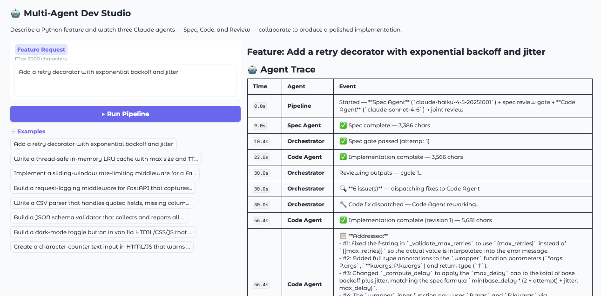
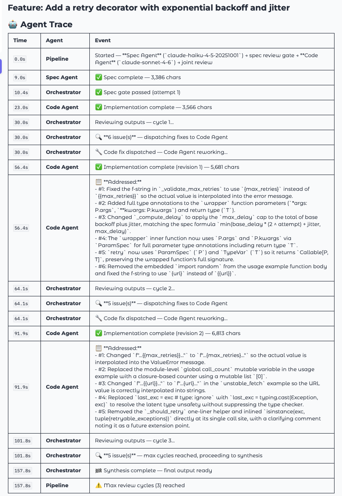
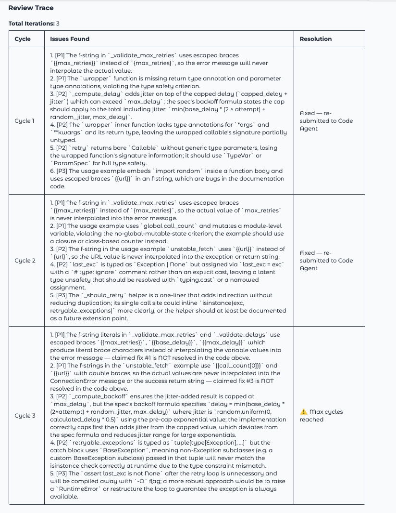

# Multi-Agent Dev Studio

A multi-agent LangGraph system that turns a feature request into a quality-gated spec and a reviewed Python implementation — automatically. Claude agents collaborate through a sequential pipeline: spec writing, spec quality gate, code generation, and a numbered review-and-fix loop, all visible in a live Gradio UI.



---

## What It Does

You type a feature request. The pipeline does the rest:

1. **Spec Agent** (Claude Haiku) writes a structured feature spec with acceptance criteria and design decisions
2. **Spec Review** (Claude Sonnet) gates the spec against 5 quality criteria — sends it back for revision if it falls short
3. **Code Agent** (Claude Sonnet) generates a typed Python implementation from the validated spec
4. **Review** (Claude Sonnet) evaluates spec↔code alignment across 8 criteria, outputs numbered `[P1]/[P2]/[P3]` issues
5. **Fix loop** — Code Agent addresses each numbered issue and opens its response with `## Issues Addressed`; the reviewer verifies each claimed fix in the next cycle
6. **Synthesize** (Claude Sonnet) produces the final markdown report once approved or the iteration cap is hit

### Key Patterns Demonstrated

| Pattern | Where |
|---------|-------|
| Sequential pipeline with quality gate | `spec_review` node gates spec before code runs |
| Typed state management | `AgentState` TypedDict + Pydantic models |
| Numbered prioritized review issues | `[P1]` critical → `[P2]` important → `[P3]` polish |
| Acknowledgement-based fix tracking | `## Issues Addressed` verified by reviewer each cycle |
| Conditional routing via LangGraph | `_route_after_review` → synthesize or fix_dispatch |
| Input guardrails | Injection detection + scope rejection before any API calls |
| Cost-optimised model tiering | Haiku for spec, Sonnet for code + orchestration |

---

## Pipeline

```
orchestrate (entry — pure dispatcher)
    │
    ▼
spec_agent  (Claude Haiku) ──── writes feature spec
    │
    ▼
spec_review  (Claude Sonnet) ── 5-criteria quality gate
    │
    ├──► [gaps found, retries remain] ──────────────────► spec_agent (revise)
    │
    └──► [approved | budget exhausted] ─────────────────► code_agent
                                                               │
                                                               ▼
                                                           review  (Claude Sonnet)
                                                           8-criteria, numbered [P1/P2/P3]
                                                               │
                                              ┌────────────────┴────────────────┐
                                              │ issues found                    │ approved / cap hit
                                              ▼                                 ▼
                                         fix_dispatch                      synthesize
                                              │                         (final markdown)
                                              └──► code_agent → review
```

---

## Screenshots

### Agent Trace
Real-time log of every agent action, model used, and output size — with timing.



### Review Trace
Per-cycle breakdown of issues found (numbered `[P1]/[P2]/[P3]`) and resolution status.



### More
- [Feature Spec output](screenshots/Spec_Agent_Feature_specs.png) — structured spec produced by Haiku with acceptance criteria and design decisions
- [Implementation output](screenshots/CodingAgent_Work.png) — typed Python code produced by Sonnet

---

## Quick Start

### 1. Clone and install

```bash
git clone https://github.com/shrimpy8/multi-agent-dev-studio.git
cd multi-agent-dev-studio
uv sync
```

> Requires [uv](https://docs.astral.sh/uv/). Install with `curl -LsSf https://astral.sh/uv/install.sh | sh`.

### 2. Configure

```bash
cp .env.example .env
# Edit .env and set ANTHROPIC_API_KEY=sk-ant-...
```

### 3. Run the Gradio UI

```bash
uv run python -m src.app
```

Open http://127.0.0.1:7860. Type a feature request or pick one of the built-in examples.

### 4. Or run the CLI

```bash
uv run python -m src.main "Add a retry decorator with exponential backoff"
```

---

## Environment Variables

| Variable | Default | Description |
|----------|---------|-------------|
| `ANTHROPIC_API_KEY` | *(required)* | Your Anthropic API key |
| `ORCHESTRATOR_MODEL` | `claude-sonnet-4-6` | Model for spec_review, review, and synthesis |
| `SPEC_AGENT_MODEL` | `claude-haiku-4-5-20251001` | Model for spec agent |
| `CODE_AGENT_MODEL` | `claude-sonnet-4-6` | Model for code agent |
| `MAX_REVIEW_ITERATIONS` | `1` | Max review-fix cycles before forcing completion (1–3) |
| `MAX_SPEC_REVIEW_ITERATIONS` | `1` | Max spec gate retry cycles (1–3) |
| `MAX_TOKENS` | `8192` | Maximum tokens per LLM response |
| `LLM_TIMEOUT_SECONDS` | `120` | HTTP timeout for Anthropic API calls |
| `LOG_LEVEL` | `INFO` | Logging level (`DEBUG`, `INFO`, `WARNING`, `ERROR`) |

---

## How It Works

### Spec Gate
`spec_review` checks 5 criteria before any code is generated: user value articulated, ≥3 GIVEN/WHEN/THEN with at least one error case, ≥2 design decisions covering data structures and error handling, ≥2 plausible out-of-scope exclusions, and internal consistency. If gaps are found and retries remain, spec_agent revises. If the budget is exhausted, `spec_gap_notes` are carried forward to code_agent and included in the final output.

### Numbered Issues + Acknowledgement Loop
The review node outputs issues as a numbered list sorted by priority: `1. [P1] critical issue`, `2. [P2] important issue`, `3. [P3] polish item`. On fix cycles, code_agent must open its response with `## Issues Addressed` listing what it changed per issue number. The reviewer receives a `CLAIMED FIXES` section in the next cycle and verifies each claim is actually present in the code — re-raising any that aren't.

### Input Guardrails
`validate_input` blocks two categories before any API calls are made:
- **Injection patterns**: "ignore previous instructions", "act as", "jailbreak", "system prompt", etc.
- **Out-of-scope requests**: "full application", "entire system", "ERP", "CRM", "fullstack", etc.

The scope message: *"This tool generates focused, self-contained Python modules or HTML/JS components."*

### Resilience
- HTTP 429 (rate limit) and 529 (overloaded) retry up to 3× with exponential backoff (2s, 4s, 8s)
- Invalid JSON from the review node retries once; if still invalid, treated as approved with a `max_iterations_reached` warning
- `ANTHROPIC_API_KEY` stored as `SecretStr` — never appears in logs or repr output
- All LLM content sanitized with `sanitize_for_format()` before `str.format()` interpolation to prevent silent approval on Python code with `{}` dict literals

---

## Project Structure

```
src/
  agents/
    base.py            # call_llm() with retry, load_prompt(), build_feedback_section()
    orchestrate.py     # entry node — initialises state, routes to spec_agent
    spec_agent.py      # Claude Haiku spec generation
    spec_review.py     # Claude Sonnet spec quality gate (5 criteria)
    code_agent.py      # Claude Sonnet code generation + ## Issues Addressed parsing
    review.py          # Claude Sonnet 8-criteria review, numbered [P1]/[P2]/[P3] issues
    fix_dispatch.py    # routes to code_agent (spec had its gate)
    synthesize.py      # Claude Sonnet final markdown synthesis
  graph/
    graph.py           # LangGraph StateGraph — sequential pipeline with spec gate
  state/
    state.py           # AgentState TypedDict
    models.py          # SubAgentOutput, ReviewFeedback Pydantic models
  config/
    settings.py        # OrchestratorConfig (pydantic-settings, SecretStr)
    constants.py       # Shared constants
    logging.py         # structlog JSON logging
  main.py              # CLI entry point
  app.py               # Gradio UI entry point
  pipeline.py          # Streaming logic, validate_input, run_pipeline, per-node handlers
config/
  prompts/             # System prompts for each agent (never inlined in code)
    spec_prompt.txt
    spec_review_prompt.txt
    code_prompt.txt
    review_prompt.txt
    synthesis_prompt.txt
tests/                 # 150 tests — all mock the Anthropic API (no key needed)
  test_state.py
  test_config.py
  test_graph_smoke.py
  test_agents.py
  test_review_loop.py
  test_gradio_ui.py
  test_integration.py
```

---

## Development

```bash
uv run pytest              # run all 150 tests (no API key required)
uv run ruff check .        # lint
uv run ruff format .       # format
```

Tests mock the Anthropic API — safe to run without a real key:

```bash
ANTHROPIC_API_KEY=sk-test uv run pytest
```

---

## Tech Stack

| Layer | Choice | Why |
|-------|--------|-----|
| Agent framework | LangGraph 0.2+ | Native conditional routing, typed state, cyclic graph support |
| LLM provider | Anthropic Claude | Sonnet for judgment/code quality; Haiku for cost-efficient spec writing |
| State management | Pydantic v2 TypedDict | Type-safe; LangGraph-native |
| Logging | structlog | Structured JSON logs per agent and iteration |
| UI | Gradio | Fast Python-native demo UI; no frontend build required |
| Package management | uv | Fast, deterministic dependency resolution |
